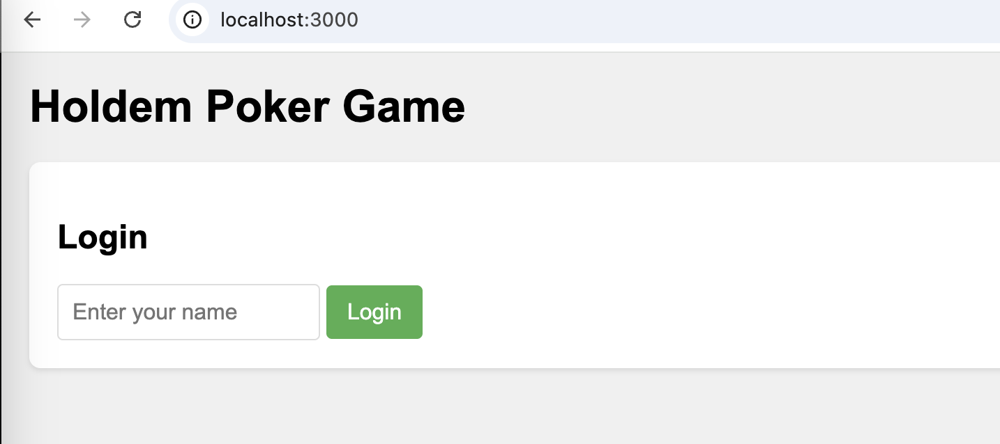
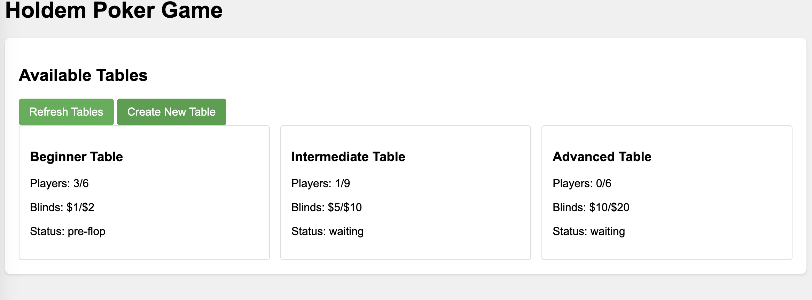
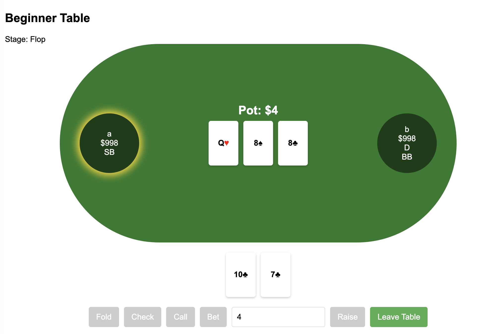
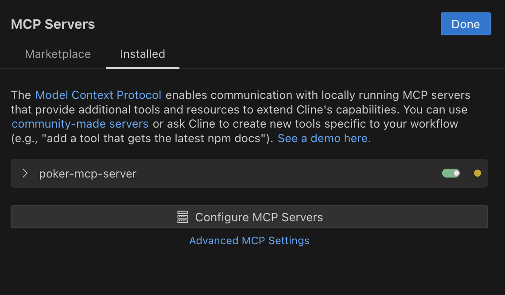

# Texas Holdem MCP Server

This is an [Model Context Protocol server](https://github.com/modelcontextprotocol/servers) that allows an MCP client agents to play a game of [Texas Holdem poker game](<https://simple.wikipedia.org/wiki/Texas_hold_%27em>). It is implemented with Node.js and TypeScript, including game server, game client, and a MCP Server.

Most Code in this project is generated by AI(Claude-3.7-Sonnet), and it tooks about 5 hours to improve and debug. Its Amazing!

<a href="https://glama.ai/mcp/servers/@freshlife001/mcp_poker">
  
</a>







## Getting started

* Build :

```bash
npm install
npm run build
```

* Run Poker Server:

```bash
npm run dev
```

* Open Poker Client:
Open your browser visit http://localhost:3000/

- Configure your MCP client to add the tool. For example, here is how to add the tool to Cline, assuming you cloned the repo at `/path/to/poker-mcp-server`:

```JSON
{
  "mcpServers": {
    "poker-mcp-server": {
      "command": "node",
      "args": ["/path/to/poker-mcp-server/dist/mcpServer.js"],
      "env": {
        "DEBUG": "*"
      }
    }
  }
}
```

- Cline:

  

## Example prompt

```
You are a Texas Hold'em poker expert. Please use the name "Super Awesome Pro" to join a Texas Hold'em poker game and win more chips. You can only use the functions provided by the poker-mcp-server MCP server. After joining the game, you must wait for your turn to act before proceeding to the next move.
```

Enjoy Playing Poker With LLM!